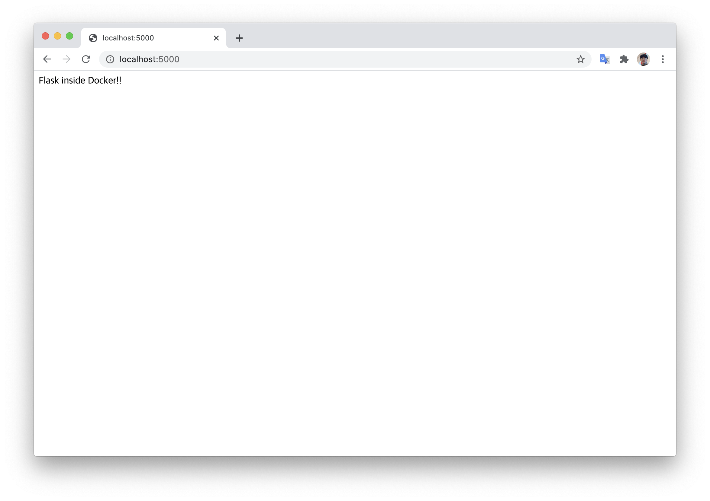

# DockerTutorial
Simplest Docker Tutorial

# Hello World
We will use https://github.com/shekhargulati/python-flask-docker-hello-world



```
git clone https://github.com/shekhargulati/python-flask-docker-hello-world.git
cd python-flask-docker-hello-world
docker build -t simple-app .
docker run -it -p 5000:5000 simple-app
```

# Installing Docker on Ubuntu
```
curl -fsSL https://download.docker.com/linux/ubuntu/gpg | sudo apt-key add -
sudo add-apt-repository \
   "deb [arch=amd64] https://download.docker.com/linux/ubuntu \
   $(lsb_release -cs) \
   stable"
sudo apt-get update
sudo apt-get install docker-ce
sudo usermod -aG docker $USER
```
## Installing nvidia-docker
```
distribution=$(. /etc/os-release;echo $ID$VERSION_ID)
curl -s -L https://nvidia.github.io/nvidia-docker/gpgkey | sudo apt-key add -
curl -s -L https://nvidia.github.io/nvidia-docker/$distribution/nvidia-docker.list | \
sudo tee /etc/apt/sources.list.d/nvidia-docker.list

sudo apt-get update && sudo apt-get install -y nvidia-container-toolkit
sudo systemctl restart docker
```

# Essential Commands
### Preparing Image
```
docker pull <image_name>  # Download image from docker hub
docker images  # Show all images
```

### Running
#### Simple Run
**Running shell directly. Check <image_name> from ```docker images```**
```
docker run -it <image_name> /bin/bash
```
Example
```
docker run -it ubuntu
```

#### Running shell background daemon
```
docker run -it -d <image_name>
```

#### Running with GPUs
```
docker run --gpus all -it <image_name> /bin/bash
docker run --gpus 2 -it <image_name> /bin/bash  # Run two gpus available.
docker run --gpus '"device=0,1,2,3"' -it <image_name> /bin/bash  # Run 4 GPU id=0,1,2,3
```

#### Exit shell without stopping container.
```
<CTRL+P> + <CTRL+Q>
```

#### Share storage with system
```
docker run -v <system_directory>:<container_directory> ...
```
Example
```
docker run -it -v /home/yoongi/Projects:/data pytorch/pytorch:latest /bin/bash
```

#### Expose port
```
docker -p <system_port>:<container_port> ...
```
Example
```
docker run -it -p 5555:5555 -p 5556:5556 --gpus 1 yoongicomcomai/bert-as-service-base:latest /bin/bash
```

#### Using GUI programs such as cv2.imshow()
```
xhost +local:docker
docker run -v /tmp/.X11-unix:/tmp/.X11-unix -e DISPLAY=$DISPLAY -e QT_X11_NO_MITSHM=1
```

### Check running containers
```
docker ps  # Check running containers
docker ps -a  # Show all containers including stopped containers
```

### Save running container as image
```
docker commit <container_id> <username/imagename:tag>  # Save running docker as image
docker stop <container_id>  # Check 'docker ps'
docker rm <container_id>  # Delete a stopped container. Check 'docker ps -a'
```

### Upload to DockerHub
Sign up https://hub.docker.com/
```
# 1. Rename local image same as dockerhub name
docker tag <image_name:tag> <dockerhub_username/imagename:tag>

# 2. Login to docker hub
docker login

# 3. Push layers
docker push <dockerhub_username/imagename:tag>
```

### Delete docker image
```
# 1. Check what image to delete
docker images

# 2. Delete an image. ### Becarefull Not to delete other's images ###
docker rmi <image_id>
```

### Build Dockerfile
```
docker build -t <image_name> <path to directory containing Dockerfile>
```

